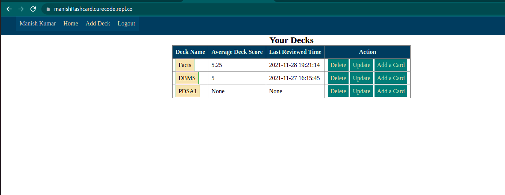

### Flash_Card_Project_IITM
#### Technology used
- HTML
- CSS
- Python
- flask
- SQLite
#### Technical details  
- main.py file contains all controller so Run code from main.py file

- Now you will have to register

- After registering - login

- After login- you are at root end point

- Now you can create a deck

- Inside a deck, you can create cards

- By clicking on a deck on the home page- you can review cards of that deck

- On review page, you can see answer by clicking on show answer button

- After review a card you, select difficulty and submit response.
- if Difficulty equals
   - easy &rarr; score=10 and you will be able see that card after 10 minutes.
   - medium &rarr; score=5 and review after 5 minutes
   - hard &rarr; score=1 and review after 1 minute
  
- At home page - deck score is average score of cards

- If a deck is not opening:
    - Either there is no card or 
    - No card left to review right now, so wait
 
#### More about the project
- Live link : [Go](https://manishflashcard.curecode.repl.co/)
- Screenshot: 
      
###### This project is part of academic activity for MAD1 at IITM
